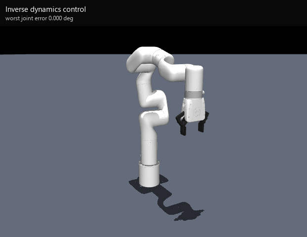
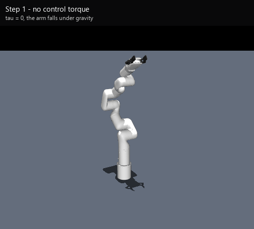
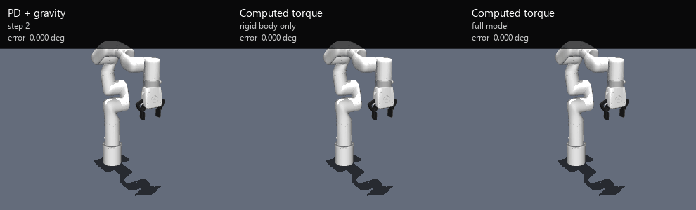
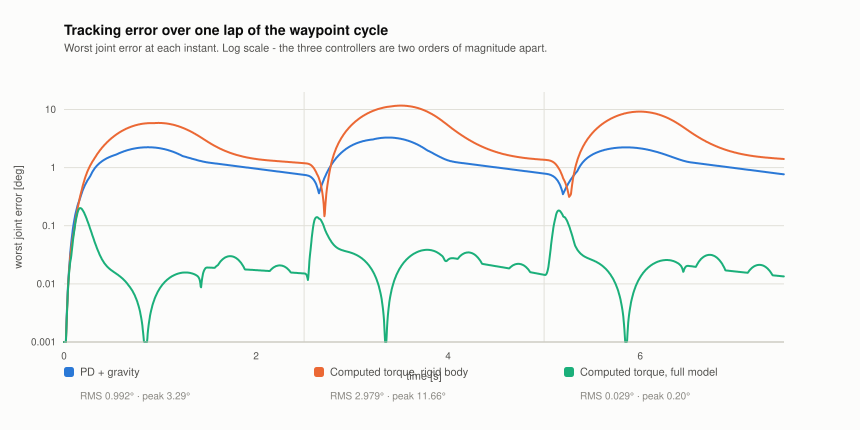
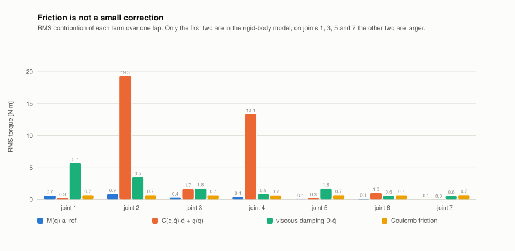
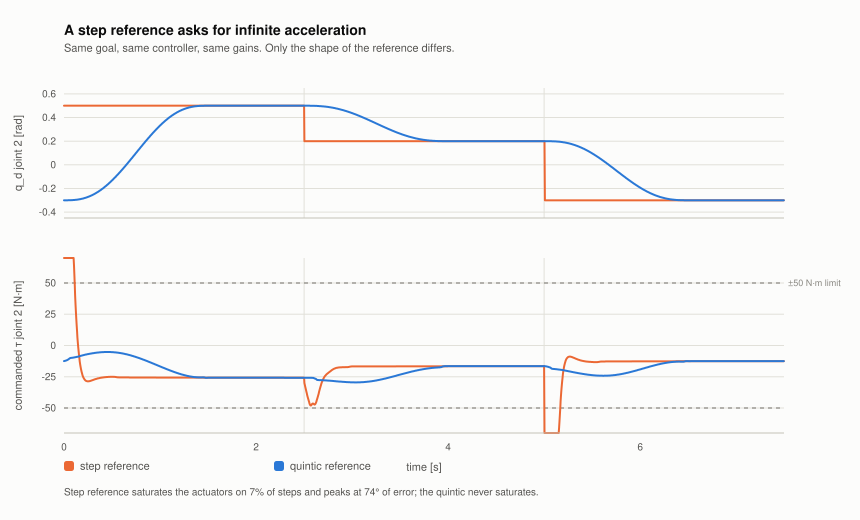
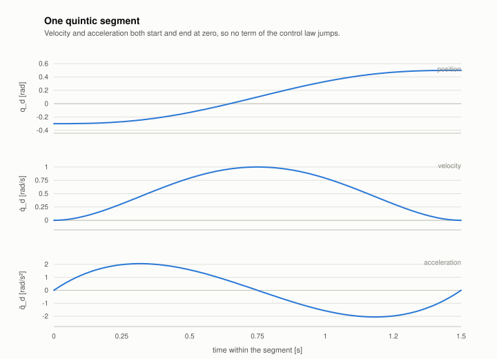

# Upravljanje momentima u zglobovima robota xArm7 (MuJoCo)

Tri upravljačka zakona na nivou momenata u zglobovima, realizovana na robotskoj ruci
UFACTORY xArm7 sa sedam stepeni slobode. Svaki naredni korak nadograđuje prethodni.
Simulaciju dinamike radi MuJoCo i zamenjuje realnog robota, dok Pinocchio računa
model krutog tela na kome se zasniva upravljanje. Pre nego što se model iskoristi, u
svakom koraku proverava se slaganje sa simulatorom.

<p align="center">
  
</p>


Projekat iz predmeta *Odabrana poglavlja iz Industrijske robotike*, doktorske studije, Fakultet tehničkih nauka,
Univerzitet u Novom Sadu.

**🇬🇧 [This page in English](README.md)**

---

## Tri koraka

| Korak | Skripta | Upravljački zakon |
|---|---|---|
| 1 | [`step1_gravity_only.py`](step1_gravity_only.py) | `τ = 0` |
| 2 | [`step2_PD_with_gravity_compensation.py`](step2_PD_with_gravity_compensation.py) | `τ = g(q) + Kp·e + Kd·ė` |
| 3 | [`step3_computed_torque.py`](step3_computed_torque.py) | `τ = M(q)·a_ref + C(q,q̇)·q̇ + g(q) + trenje` |

## Pokretanje

```bash
conda env create -f environment.yml
conda activate robotika

python step1_gravity_only.py
python step2_PD_with_gravity_compensation.py
python step3_computed_torque.py
```

Pinocchio se instalira isključivo sa conda-forge kanala, pošto za Windows ne postoji
odgovarajući paket na PyPI-ju. Treba obratiti pažnju i na to da na PyPI-ju postoji paket
pod istim imenom `pinocchio`, ali je reč o drugom, odavno napuštenom projektu. Ako se
instalira pip-om, dobija se prazan modul u kome nema funkcije `buildModelFromMJCF`.

Tasteri, dok je prozor simulatora aktivan:

| Taster | Radnja |
|---|---|
| `SPACE` | pauza i nastavak simulacije |
| `R` | povratak u početnu pozu |
| `A` | automatsko kretanje kroz zadate poze |
| `1` `2` `3` | prelazak u pozu 1, 2 ili 3 |
| `C` | izbor upravljačkog zakona (samo 3. korak) |
| `E` | poništavanje statistike greške (samo 3. korak) |
| `ESC` | izlaz |

---

## 1. korak: samo gravitacija

<p align="center">
  
</p>

Momenti u svim zglobovima jednaki su nuli, pa ruka pada pod sopstvenom težinom. 
Svrha ovog koraka je poređenje gravitacionih momenata koje
Pinocchio računa iz MJCF opisa sa vrednostima koje daje MuJoCo kroz `qfrc_bias`.
Odstupanje je reda veličine 1e-13 N·m. Pošto se i drugi i treći korak oslanjaju na
pretpostavku da Pinocchio opisuje istog robota kog MuJoCo simulira, ovu proveru je
korisno uraditi na samom početku.

## 2. korak: PD regulator sa kompenzacijom gravitacije

$$\tau = g(q) + K_p (q_d - q) + K_d(\dot q_d - \dot q)$$

Uticaj gravitacije se poništava unapred (feedforward), a sve ostalo preuzima PD regulator. Rezultat je
zadovoljavajuć, ali se pojačanja teško podešavaju. Efektivna inercija koja deluje na
pojedini zglob zavisi od trenutne konfiguracije ruke, pa je ispruženu ruku znatno teže
pokrenuti nego skupljenu. Zbog toga jedna te ista vrednost pojačanja u jednoj pozi daje
previše mek, a u drugoj previše nagao odziv, i zato se u kodu nalazi sedam ručno podešenih
parova pojačanja.

## 3. korak: inverzna dinamika (computed torque)

$$\tau = M(q)\,a_{\text{ref}} + C(q,\dot q)\dot q + g(q) + D\dot q + f_c \tanh(\dot q / \varepsilon)$$

$$a_{\text{ref}} = \ddot q_d + K_d(\dot q_d - \dot q) + K_p(q_d - q)$$

Umesto da se sa porastom greške povećava dejstvo regulatora, ovde se računa moment koji je
ruci zaista potreban za traženo kretanje, na koji se zatim dodaje manja korekcija. Kada se
takav zakon uvrsti u jednačine dinamike robota, dobija se

$$\ddot e + K_d \dot e + K_p e = 0$$

odnosno isti sistem drugog reda za svaki zglob i u svakoj konfiguraciji. Time podešavanje
pojačanja prestaje da bude eksperimentalno i svodi se na izbor polova.
Usvaja se jedna sopstvena učestanost, `OMEGA = 20 rad/s`, uz kritično prigušenje, iz čega
neposredno slede `Kp = OMEGA²` i `Kd = 2·OMEGA`.

---

## Rezultati

Sva tri zakona, ista zadata putanja i ista pojačanja:

<p align="center">
  
</p>

| Upravljački zakon | RMS greška | Maksimalna greška |
|---|---:|---:|
| PD sa kompenzacijom gravitacije (2. korak) | 0.992° | 3.29° |
| Inverzna dinamika, samo kruto telo | 2.979° | 11.66° |
| **Inverzna dinamika, potpun model** | **0.029°** | **0.20°** |

<p align="center">
  <picture>
    <source media="(prefers-color-scheme: dark)" srcset="docs/figures/tracking-error-dark.svg">
    
  </picture>
</p>

Same vrednosti nalaze se u fajlu [`docs/results.csv`](docs/results.csv).

## Problem trenja

Najzanimljiviji je srednji red u toj tabeli. Zakon zasnovan na modelu, od koga se očekivalo
poboljšanje, pokazao se tri puta lošijim od običnog PD regulatora iz drugog koraka.

Udžbenički izvod polazi od pretpostavke da se robot sastoji samo od krutih tela sa masom.
Međutim, u fajlu `xarm7.xml` svakom zglobu ruke pridruženo je i viskozno prigušenje
(10/10/5/5/5/2/2 N·m·s/rad) i Kulonovo trenje (`frictionloss`) od 1 N·m. Te sile postoje u
simulaciji, ali nisu deo izraza $M\ddot q + C\dot q + g$. MuJoCo ih svrstava u
`qfrc_passive`, a ne u `qfrc_bias`, pa ih model krutog tela koji Pinocchio formira iz istog
fajla uopšte ne obuhvata. Samim tim ih upravljački zakon ni ne poništava.

Pokazuje se da te veličine nisu zanemarljive:

<p align="center">
  <picture>
    <source media="(prefers-color-scheme: dark)" srcset="docs/figures/torque-breakdown-dark.svg">
    
  </picture>
</p>

U zglobovima 1, 3, 5 i 7 članovi trenja premašuju ukupan doprinos krutog tela. Reč je o
zglobovima čije se ose poklapaju sa pravcem ruke, pa oni praktično i ne nose gravitaciono
opterećenje. Jedino su drugi i četvrti zglob pretežno opterećeni gravitacijom.

Linearizacija povratnom spregom je prema ovakvim propustima znatno osetljivija od PD
regulatora. Ona počiva na tome da se dinamika sistema tačno poništi, pa sve što ostane
neponišteno prelazi neposredno u grešku praćenja. PD regulator, sa druge strane, nikada
nije ni polazio od poznavanja modela, te isto to trenje jednostavno prihvata kao dodatno
prigušenje.

Uz vrednost od 0.029° ide i jedna napomena. Model na kome se zasniva upravljanje i model
koji se simulira potiču iz istog XML fajla. Taj podatak pokazuje da metoda radi, ali ne
govori o tome kako bi se ponašala na stvarnom robotu.

## Zašto zadata putanja mora biti glatka

Upravljački zakon unapred koristi željeno ubrzanje $\ddot q_d$, pa zadata veličina ne sme
biti odskočna funkcija. U drugom koraku se prelazilo skokovito iz jedne poze u drugu, čime
se zahteva beskonačno ubrzanje, a posledica je zasićenje pogona.

<p align="center">
  <picture>
    <source media="(prefers-color-scheme: dark)" srcset="docs/figures/step-vs-quintic-dark.svg">
    
  </picture>
</p>

Pri odskočnoj referenci isti zakon dovodi pogone u zasićenje u 7% koraka simulacije, uz
najveću grešku od 74°. Zbog toga se zadate poze povezuju polinomima petog reda. Oni počinju
i završavaju se u stanju mirovanja, sa nultim ubrzanjem, a primaju i proizvoljne početne
uslove. Zahvaljujući tome, pritisak na taster `2` usred kretanja ka trećoj pozi pokreće
novu putanju iz zatečenog stanja, bez skokovite promene.

<p align="center">
  <picture>
    <source media="(prefers-color-scheme: dark)" srcset="docs/figures/quintic-profile-dark.svg">
    
  </picture>
</p>

---

## Sadržaj repozitorijuma

```
step1_gravity_only.py                    τ = 0 i provera gravitacije Pinocchio/MuJoCo
step2_PD_with_gravity_compensation.py    PD sa kompenzacijom gravitacije
step3_computed_torque.py                 inverzna dinamika, polinomijalne putanje, poređenje
controllers/impedance_control.py         impedansno upravljanje (u izradi)
tools/
    _sim.py            pokretanje simulacije bez prikaza, oko upravljanja iz 3. koraka
    _svg.py            jednostavan generator SVG grafika
    benchmark.py       pokreće upravljanja i pravi docs/results.csv i docs/figures
    record_media.py    renderovanje bez prikaza, pravi docs/media
docs/
    figures/           grafici, u svetloj i tamnoj varijanti
    media/             animacije i slike
    results.csv        vrednosti prikazane u tabelama
models/xarm7/          opis robota (videti Poreklo modela)
```

## Ponovno generisanje grafika

```bash
python tools/benchmark.py       # results.csv i svi grafici
python tools/record_media.py    # sve animacije i slike
```

Nijedna od ove dve skripte ne otvara prozor simulatora. Svi brojevi i svi grafici u ovom
dokumentu nastaju upravo njihovim pokretanjem, čime se izbegava da se dokumentacija
vremenom razmimoiđe sa stvarnim ponašanjem upravljanja.

U datoteci `environment.yml` namerno nije navedena nijedna biblioteka za crtanje grafika.
Prevedeni moduli biblioteke matplotlib ne mogu da se učitaju uporedo sa ovom verzijom
MuJoCo-a i Pinocchio-a pod operativnim sistemom Windows: svaki poziv za iscrtavanje prekida
izvršavanje greškom `0xc06d007f` u modulu `matplotlib._path`, i to bez ikakve poruke. Zbog
toga `tools/_svg.py` samostalno ispisuje SVG datoteke.


## Poreklo modela

Opis robota u direktorijumu [`models/xarm7/`](models/xarm7/) nije moj rad. Preuzet je iz
zbirke [MuJoCo Menagerie](https://github.com/google-deepmind/mujoco_menagerie), a nastao je
na osnovu javno dostupnog [xArm7 URDF opisa](https://github.com/xArm-Developer/xarm_ros)
kompanije UFACTORY. Copyright © 2018 UFACTORY Inc. Uslovi korišćenja navedeni su u datoteci
[`models/xarm7/LICENSE`](models/xarm7/LICENSE) i odnose se na taj direktorijum. Sve izvan
direktorijuma `models/` je moj rad.

## Literatura

- Siciliano, Sciavicco, Villani, Oriolo, *Robotics: Modelling, Planning and Control*, pogl. 8.
- Khatib, „A Unified Approach for Motion and Force Control of Robot Manipulators: The
  Operational Space Formulation", IEEE J. Robotics and Automation, 1987.
- Slotine i Li, „On the Adaptive Control of Robot Manipulators", IJRR, 1987.
- [Dokumentacija MuJoCo-a](https://mujoco.readthedocs.io/), o toku proračuna i razlici
  između `qfrc_bias` i `qfrc_passive`.
- [Dokumentacija Pinocchio-a](https://stack-of-tasks.github.io/pinocchio/), za `crba`,
  `nonLinearEffects` i `rnea`.
